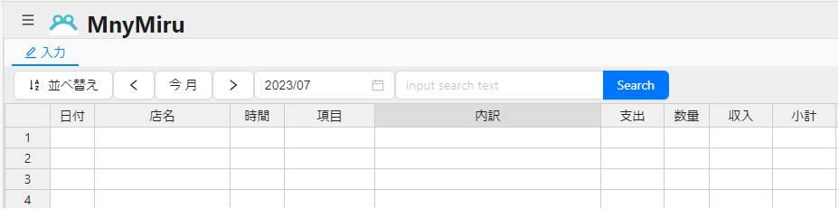
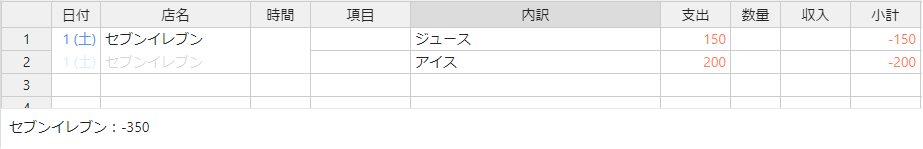
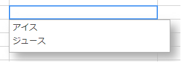
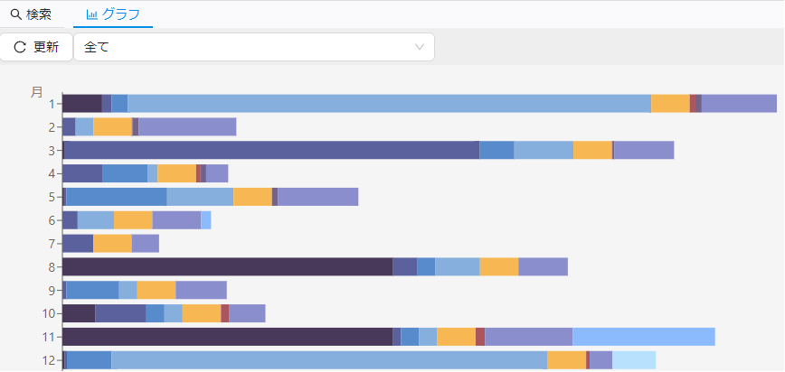

# mnymiru

MnyMiruは支出を管理するWebアプリです。

# 特徴

- EXCELシートのような画面に自由に入力

- 予算などあらかじめ設定する項目もないのですぐに始められます。

- サーバーに一切、データを保存しません。
 ※開始直後は、ブラウザ内にデータを保存されます。
 「保存」を行うことで、ローカルに保存しておくことができるようになります。

# 開始

以下のURLから最新のMnyMiruをご使用いただけます。

[https://gearsns.github.io/mnymiru/](https://gearsns.github.io/mnymiru/)

# 使い方

1. 入力
	1. 「入力」タブを選択し入力する月を設定
 
 	

	2. 支出を記入

		「日付」「店名」「時間」「項目」「現金/口座」が同じ場合、
		自動で、一つのレシートととして判定されます。  

		
		(画面下にレシートごとの合計が表示)

	3. サジェスト

		「店名」や「内訳」等は、過去の入力から自動でサジェストされます。

		

	4. 並べ替え

		「日付」と「時間」で入力したデータを並べ替えます。
		※並べ替えを行わなくても集計に影響はありません。

2. 検索

	1. 「検索」タブで検索したい単語を入力して「Search」ボタンを押下

		

	2. 検索結果をダブルクリックすると、該当の月に移動します。

3. グラフ

	1. 「グラフ」タブを選択して「更新」ボタンを押下します。

		
		(「入力」タブと同じ年の支出集計が表示されます)

4. ファイル

	1. 「新規」
		新しく入力を開始します。

	2. 「ファイルを開く」
		ローカルのファイルから入力を再開します。

	3. 「フォルダを開く」
		ローカルのファイルから入力を再開しますが、
		ファイル名が「cash.db」に固定され、「保存」の都度バックアップファイルが作成されるようになります。

	4. 「最近使用した項目を開く」
		「ファイルを開く」「フォルダを開く」で開いたファイルを開き直します。

	5. 「保存」
		ローカルにファイルを保存します。
	
	6. 「名前を付けて保存」
		名前を付けてローカルにファイルを保存します。

# 依存するライブラリ

[Ant Design](https://ant.design)
[dexie](https://dexie.org)
[handsontable 6.2.2](https://github.com/handsontable/handsontable)
[sql.js](https://github.com/sql-js/sql.js/)
